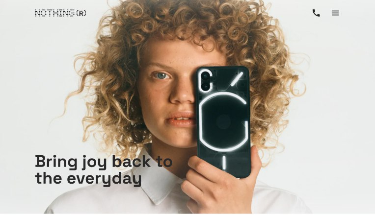
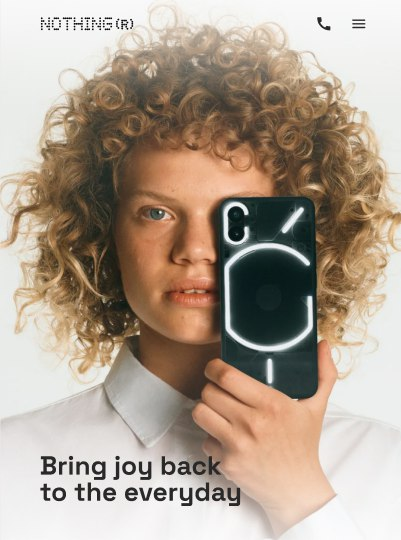
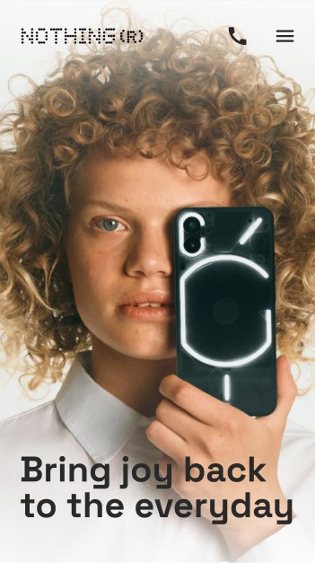

<h1>Nothing Landing Page</h1>

<im/>

This is a modern, responsive design that is optimized for various screen sizes. The page has been designed with a modern and minimalist aesthetic and features. Using the <strong>BEM methodology</strong> and <strong>SCSS</strong> made it easier to organize and maintain the code.

Desktop

Tablet

Mobile

<h2>Structure</h2>

The landing page is structured using the BEM methodology, which stands for Block, Element, Modifier. This methodology is a way of organizing CSS code that makes it easier to read, understand, and maintain.

The landing page consists of several different blocks, including the header, navigation section, recommended section, categories section, about us section and contacts.

In addition to the BEM methodology and SCSS, the landing page also utilizes the AOS (Animate On Scroll) JavaScript library to add some animation effects. AOS is a lightweight library that allows you to animate elements as they come into view, adding some interactivity to the page without being too distracting.

To ensure consistent code formatting, the landing page also utilizes Stylelint, a CSS linter that checks your code for syntax errors and style violations.

